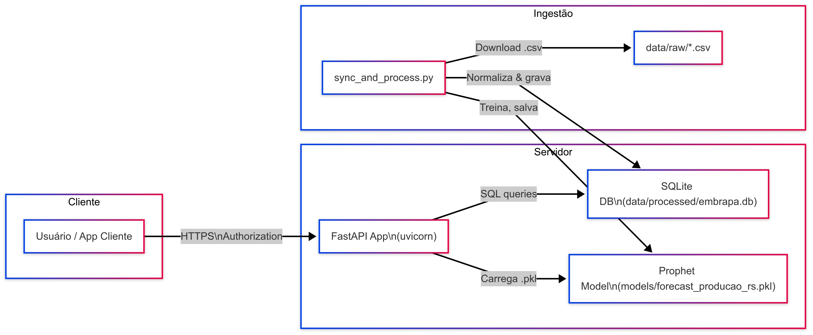

# Sobre o repositório, documentação e testes da Embrapa Vitivinicultura API

Este repositório apresenta o MVP de uma API REST para dados de uvas e derivados do Rio Grande do Sul.
A API oferece:

Produção e processamento de suco, vinho e subprodutos.

Informações de comercialização, importação e exportação.

Previsão de produção para até três meses com Prophet.

Para testar as requisições e acessar a documentação, use o Swagger, Redoc e .json:
https://embrapa-vit-api.onrender.com/docs (Utilizar o username Admin e senha Admin123)
https://embrapa-vit-api.onrender.com//redoc
https://embrapa-vit-api.onrender.com//openapi.json

# Arquiterura Embrapa Vitivinicultura API

# Detalhamento da Arquitetura

## 1. Ingestão de Dados (Sync & Process)
### Agendador / Startup Hook

Ao iniciar (ou numa rotina diária agendada, por exemplo via cron dentro do container), dispara o script sync_and_process.py.

### Download de CSVs

O script faz um HTTP GET na página de index (/download/) da Embrapa, extrai a lista de arquivos e suas datas de modificação.

Compara com um arquivo local state.json para saber quais são novos ou atualizados.

### Detecção e Leitura de Cabeçalho

Para cada CSV novo/atualizado, lê o arquivo em modo texto buscando a linha que de fato contém o cabeçalho (coluna “UF”, “ID”, “Produto” ou “Ano”).

Faz pd.read_csv(..., sep=";", header=linha_detectada) (com fallback para vírgula, se necessário).

### Normalização das Colunas-Ano

Converte todas as colunas cujo nome seja um ano (quatro dígitos) para int, coerindo valores inválidos para zero.

No caso do arquivo de produção, filtra somente as linhas do estado RS e faz um melt para gerar duas colunas fixas:

Ano (int)

Quantidade (int)

Gravação em Banco SQLite

Cada CSV vira uma tabela no SQLite (<nome_csv_sem_extensão>, tudo em minúsculas).

Ex.: Producao.csv → tabela producao (Quantidade por Produto e Ano),
Comercio.csv → comercio, etc.

### Treino de Modelo de Forecast (Prophet)

Se a tabela producao mudou, o script lê todos os anos e quantidades, agrupa por ano, treina um Prophet para previsão futura e salva o modelo serializado em models/forecast_producao_rs.pkl.

### Estado Local Atualizado

Atualiza o state.json com as novas datas de modificação para não baixar o mesmo CSV novamente.

## 2. Armazenamento e Persistência
Raw Data: data/raw/*.csv — arquivos originais baixados.

Processed Data: data/processed/embrapa.db — arquivo SQLite com todas as tabelas normalizadas.

Modelos: models/*.pkl — arquivos serializados para previsão.

Logs: logs/update.log — histórico de downloads, leituras, erros e treinos.

## 3. API REST (FastAPI)
### Inicialização

FastAPI carrega na inicialização o SQLite (embrapa.db) e os modelos (quando usados).

### Endpoint de Autenticação JWT

Endpoint POST /token: recebe username/password, verifica em tabela users (com senhas bcrypt), gera JWT com tempo de vida configurável.

Todos os endpoints protegidos exigem header Authorization: Bearer <token>.

###  Inicialização

Ao iniciar a aplicação, a API executa um ciclo lifespan que:

- Cria ou atualiza o banco de autenticação (users.db)
- Baixa arquivos JSON da Embrapa e salva como CSV
- Popula o banco SQLite (embrapa.db) com os dados processados
- Remove arquivos temporários de data/raw/

### Endpoint de Autenticação (JWT)

- POST /token: autentica com username/password e retorna um JWT com tempo de expiração configurável.
Todos os endpoints protegidos exigem:
Authorization: Bearer <token>

### Endpoints de Consulta
 
Endpoint	Descrição
GET /producao	Produção de uvas (intervalo de anos) (protegido)
GET /processamento	Processamento por tipo de uva (protegido)
GET /comercializacao	Comercialização de produtos vitivinícolas (protegido)
Parâmetros opcionais: ano_inicio, ano_fim, tipo, produto.

### Endpoint de Comércio Exterior

GET /comex  (protegido)

Consulta dados de importação ou exportação por produto (tabela) e intervalo de anos.

Produtos válidos para exportação começam com exp e importação, imp:
expvinho, expsuco, expuva, expespumantes, impvinhos, impfrescas, impespumantes, imppassas, impsucos.

Retorno em formato longo: ano, país e valor.

### Endpoint de Forecast

GET /forecast/producao (protegido)

Carrega o modelo Prophet (.pkl), gera o futuro dataframe, faz predict() e devolve histórico + previsões.

### Endpoint para limpar Json

GET /openapi-limpo
Consulta a especificação OpenAPI da API publicada (em JSON) e remove caracteres especiais, acentos e espaços para facilitar uso por sistemas externos.

### Documentação Automática

Swagger UI, Redoc e onpenai.json.

## 4. Containerização e Deploy
### Dockerfile

Imagem base Python 3.11-slim.

Copia código, instala dependências (requirements.txt), define CMD ["uvicorn", "app.api:app", "--host", "0.0.0.0", "--port", "8000"].

### Volumes

Mapeia data/raw, data/processed, models, logs para armazenamento persistente no host ou serviço de arquivos do provedor.

### Deploy em Render

Push no GitHub dispara build automático no Render.

Render instala dependências, constrói a imagem, executa o container.

Variáveis de ambiente (p.ex. JWT_SECRET_KEY) configuradas no painel.

### Agendamento da Ingestão

Cron interno no container que chama python app/sync_and_process.py todas as noites.

## 5. Fluxo de CI/CD
### Desenvolvimento

Branch main no GitHub contém código estável.

Pull requests revisados e mesclados.

### Build & Testes

GitHub Actions roda linters e testes unitários.

### Deploy Automático

Cada push em main aciona o build no Render.

Logs de build e deploy ficam acessíveis no painel do Render.

## 6. Usuário Final / Cliente
### Consumidor da API

Pode ser um front-end React, um notebook Python, ou qualquer cliente HTTP.

Autentica via /token, usa o JWT nos headers para consultar dados e previsões.

### Observabilidade

Logs de ingestão e API mantidos em arquivos.

Métricas de uptime e erros podem ser vinculadas a um serviço externo se desejado.

